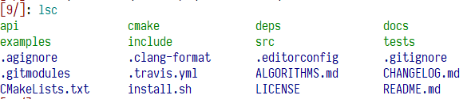
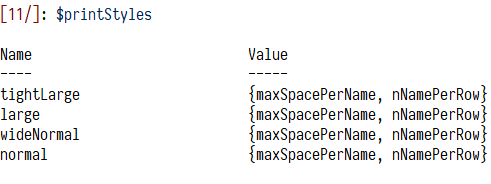
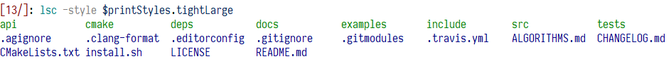
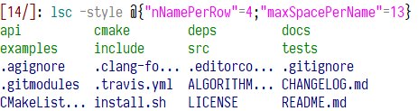
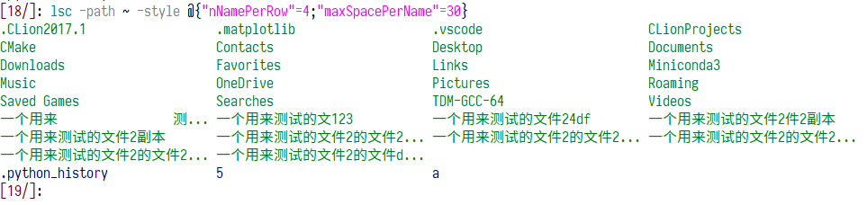
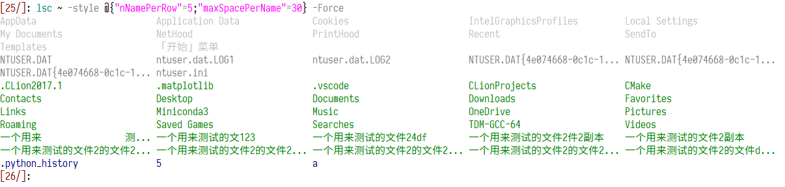

# `lsc`, a colorized `Get-ChildItem`

## Installation

put the file in to `yourname\\Documents\\WindowsPowerShell\\Modules\\lsc\\lsc.psm1` and it should work.

## Usage

`lsc -path . -style @{"maxSpacePerName"=4;"nNamePerRow"=20} -Force` or

`lsc -path . -style @{"maxSpacePerName"=4;"nNamePerRow"=20}`

Have a look at the source code! Here are some use cases.

Simply type `lsc`, you will get something like this ...

You can customize the printing style. Also, there are some built-in styles.

Use such like the following.

Or, you can use your own like this:

Chinese characters are wider than ascii ones, twice in fact. But this is not a problem.

Finally, the `-Force` parameter.

## Fiddling around the code

You can look up the code and decide to use your own color scheme. Function `getColor` is where to set the color. As for my own, I use gray to these hidden folders, dark gray  for hidden files, dark green for normal folders and dark blue for normal files.

I wish you enjoy it:)

## Miscellaneous
Have a look on my [project](https://github.com/jqly/powershell-theme) about colorized theme and customized prompt for PowerShell;)
